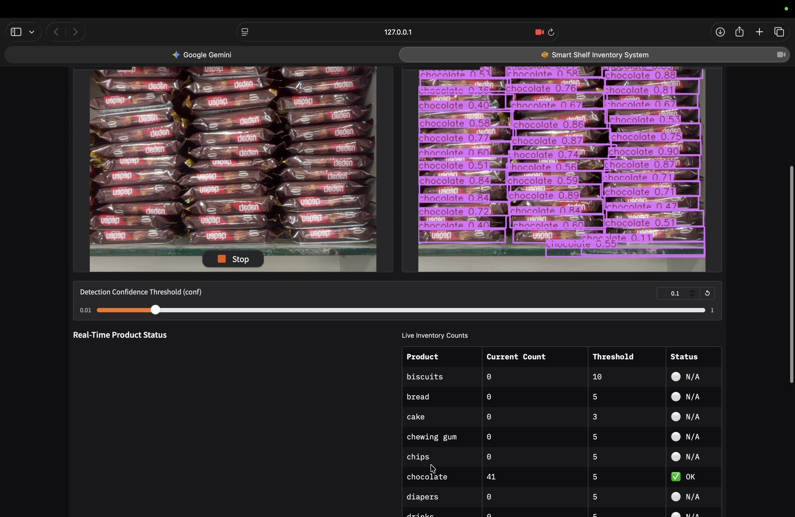
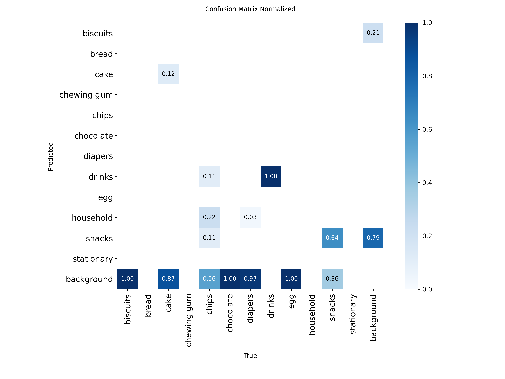
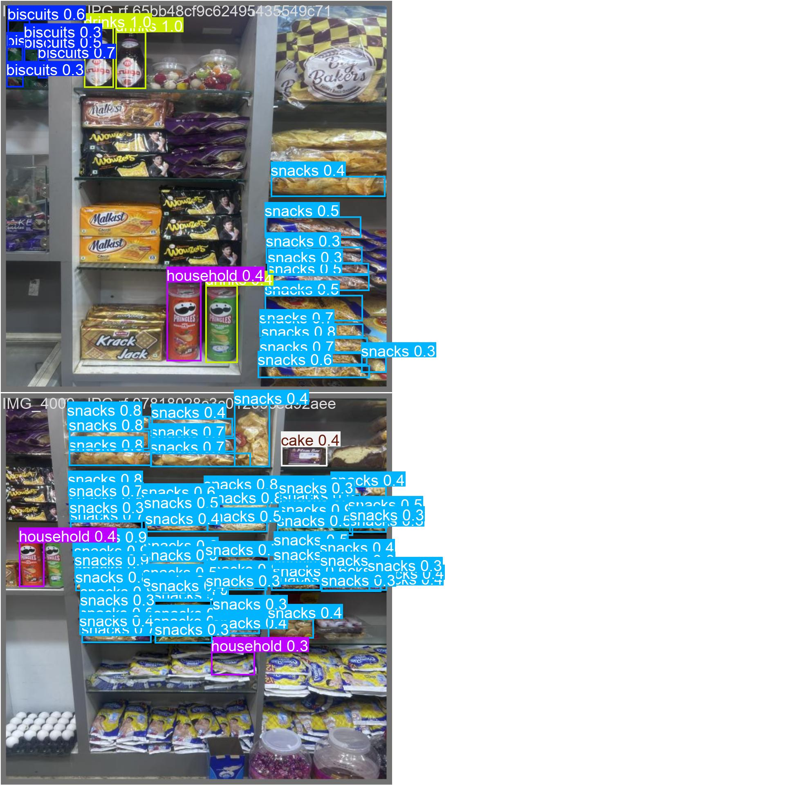

# Smart Shelf Inventory

Detect and count retail products on a shelf with YOLOv8 and raise low-stock alerts in real time, through a Gradio dashboard.



A proof-of-concept computer vision system trained on a custom-labelled dataset from a single retail store.

## Features

- Multi-class product detection (12 classes) with YOLOv8n
- Product counting from live camera input or images
- Per-class stock thresholds with low-stock alerts
- Snapshot saving for alert events
- Adjustable confidence threshold in the Gradio interface

## How it works

```
Camera / Image
      ↓
YOLOv8 detection
      ↓
Product classification + counting
      ↓
Per-class threshold check
      ↓
Inventory status
      ↓
Low-stock alert + snapshot
```

## Dataset

| | |
|---|---|
| Source | Shelf images I collected from one retail store |
| Images | 20 |
| Classes | 12  |
| Labelled boxes | 1,058 |
| Split | 17 / 2|
| Labelling | Manual, YOLO format (Roboflow) |

The raw dataset is not included because it was collected personally in a specific retail environment. To train on your own data, prepare images in YOLO format and point `data.yaml` at them.

## Results

Evaluated on the validation split:

| Precision | Recall | mAP@50 | mAP@50–95 |
|---|---|---|---|
| 53.50% | 24.03% | 26.15% | 14.27% |

The best checkpoint came from around epochs 185–187. There is no separate test set, so the checkpoint was selected on the same validation split these metrics come from, which makes them optimistic. With 20 images in total, they are also noisy. Treat them as indicative only, not as performance on unseen stores or products.

### Confusion matrix



### Sample validation predictions



## Limitations

- **Closed-set detector.** The model only recognises the 12 product classes it was trained on. Products outside that catalog are not detected.
- **Single-store data.** The training images come from one store, so shelf layout, lighting, and camera variation are limited. The model does not transfer to other stores.
- **Small dataset.** Recall is low (24%), and some classes have few examples. 

Improving this would need a larger, more varied dataset across stores, lighting, and camera angles.

## Setup

```bash
git clone https://github.com/shanumsharief/smart-shelf-inventory.git
cd smart-shelf-inventory
python3 -m venv .venv
source .venv/bin/activate
pip install -r requirements.txt
```

Trained weights: [`weights/best.pt`](weights/best.pt) (YOLOv8n, trained on the 12 classes).

## Usage

**Run the dashboard**

```bash
python app.py
```

**Train a model**

```bash
python train.py
```

Reported run: `yolov8n.pt`, 1024 × 1024 images, 200 epochs, batch size 8.

**Configuration**

- Low-stock thresholds: set in `app.py`
- Confidence threshold: adjustable in the Gradio interface
- Image size, epochs, batch size: set in `train.py`

## Project structure

```
├── app.py            # Gradio UI + inference loop
├── train.py          # YOLOv8 training script
├── data.yaml         # Dataset configuration
├── requirements.txt  # Dependencies
├── alert.mp3         # Alert sound
├── weights/          # Trained YOLOv8n checkpoint (best.pt)
├── assets/           # Result images used in this README
└── demo/             # Demo screenshot
```

## What I learned

I built the full pipeline, from collecting and labelling data to training, evaluation, real-time inference, and counting logic. The key lesson was how much dataset diversity limits real-world generalisation. The model detected products from its training store but could not recognise unseen ones, which is what a closed-set detector trained on one catalog should do.

## Future work

- Collect images across multiple stores, lighting conditions, and angles
- Evaluate on a split held out by shelf or session
- Add new products through fine-tuning on small labelled sets
- Explore open-vocabulary detection for unseen products

## Tech stack

Python · YOLOv8 (Ultralytics) · OpenCV · Gradio
